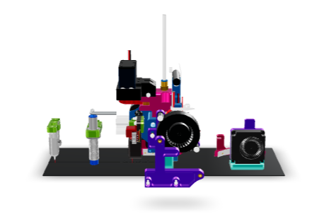

# 3D-Viewer

Repository for hosting some of my 3D-Models for model-viewer.

*Filament-Cutter Base Module*

*Filament-Cutter for E3D-V6 on Ender-3 (Creality)*

*Filament-Cutter for BIQU-H2 on Ender-3 (Creality)*

*Filament-Cutter for MicroSwiss Dual Gear Extruder on Ender-3 (Creality)*

*SMuFF Small Servo Mount*

*SMuFF IFC2 PCB & Housing*

*SMuFF V6S Linear Stepper Mount*

*SMuFF V6S Linear Stepper Mount using NEMA8*
