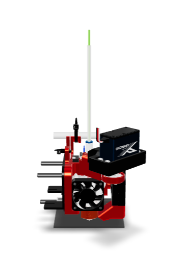

# 3D-Viewer

Repository for hosting some of my 3D-Models for model-viewer. Click on the preview images to open a model in model-viewer.

| Model | Description |
|-------|-------------|
| | *Filament-Cutter Base Module* |
|| *Filament-Cutter for E3D-V6 on Ender-3 (Creality)*|
||*Filament-Cutter for BIQU-H2 on Ender-3 (Creality)*|
||*Filament-Cutter for Orbiter 1.5 on Ender-3 (Creality)*|
||*Filament-Cutter for MicroSwiss Dual Gear Extruder on Ender-3 (Creality)*|
||*SMuFF IFC2 PCB & Housing*|
||*SMuFF V6 Small Servo Mount*|
||*SMuFF V6S Linear Stepper Mount*|
||*SMuFF V6S Linear Stepper Mount using NEMA8*|
||*SMuFF V6 Splitter Option Feeder Endstops*|
||*Smart Filament Buffer (V2)*|
||*Smart Filament Buffer (V2) PCB*|
||*SMuFF Backbone Board*|
||*SMuFF Connector Board*|
